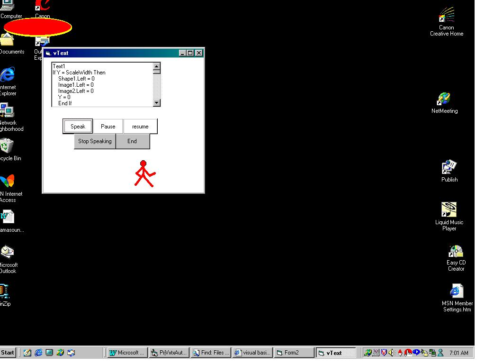



## A simple VoiceText application with custom animation

### Description

Well, a simple application with vxtauto.tlb that reads a string. I have added lip movement animation, while reading text. A timer controls the lip movements (open and close) and two images moving across the screen. Add some text in the text box and click on speak button.
 
### More Info
 

             |
---                |---
**Submitted On**   |2001-02-16 06:04:34
**By**             |[Manas Mukherjee](https://github.com/Planet-Source-Code/PSCIndex/blob/master/ByAuthor/manas-mukherjee.md)
**Level**          |Intermediate
**User Rating**    |4.0 (20 globes from 5 users)
**Compatibility**  |VB 6\.0
**Category**       |[Complete Applications](https://github.com/Planet-Source-Code/PSCIndex/blob/master/ByCategory/complete-applications__1-27.md)
**World**          |[Visual Basic](https://github.com/Planet-Source-Code/PSCIndex/blob/master/ByWorld/visual-basic.md)
**Archive File**   |[CODE\_UPLOAD150452162001\.zip](https://github.com/Planet-Source-Code/manas-mukherjee-a-simple-voicetext-application-with-custom-animation__1-21056/archive/master.zip)

